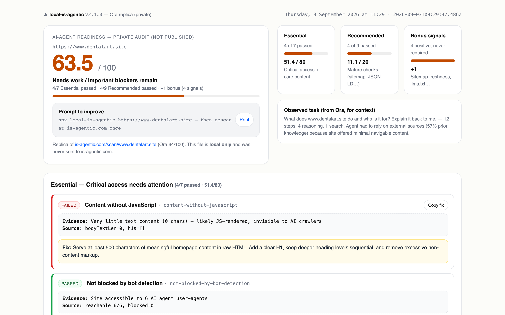
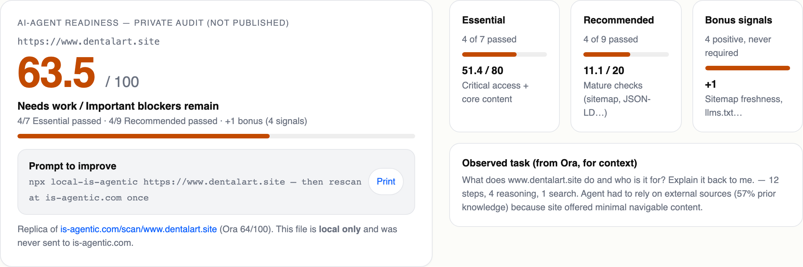
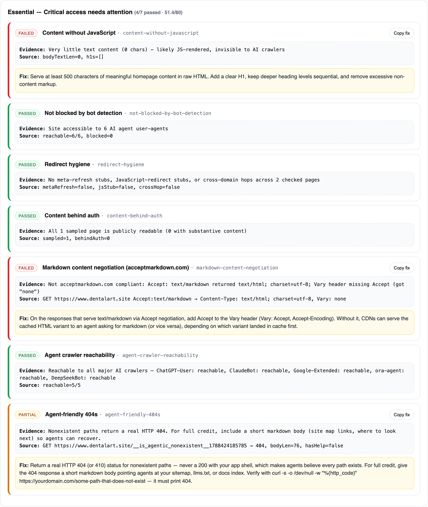
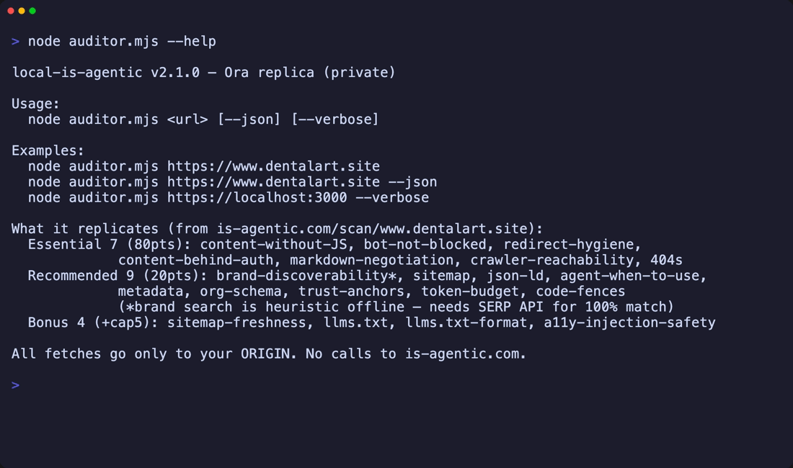

# local-is-agentic — Fix your score before it lives online forever


> Private offline replica of the public [is-agentic.com](https://is-agentic.com/methodology) Ora audit (Essential 80 + Recommended 20 + Bonus cap 5) — catch every fix locally, publish only when you're ready.



---

## Features

- **Stay private until you're proud** — audits only your origin (`fetch` never touches `is-agentic.com`, Ora, or Vercel) so `is-agentic.com/scan/<host>` never records a half-baked score.
- **Same score, same receipts** — mirrors the exact 16 mature checks + 4 bonus signals observed live on `dentalart.site` (64 → 63.5 locally), with Evidence / Fix copy-pasteable for each failure.
- **CI-ready without publishing** — `--json` shape matches `GET /api/v1/report?url=` so `jq -e '.score >= 75'` gates deploys without external rate limits (public API is 120 req/60s/IP).
- **Zero friction to run** — single file `auditor.mjs`, Node 18+ native `fetch`, 0 deps, works on `localhost:3000` and staging behind a firewall.
- **Beautiful local report** — auto-writes a timestamped `*.html` + `*.json` mirror of the public scorecard (score bar, tier breakdown, fix prompts) for sharing offline.

## Screenshots / Demo

| Private HTML report (offline, not published) | Essential failures with Evidence + Fix |
| --- | --- |
|  |  |

**CLI demo** — human + JSON in one shot (VHS scripted, re-record on output change):



> All images are scripted: `vhs /tmp/local-is-agentic-demo.tape` → `docs/screenshots/demo.gif` and Playwright `file://` capture of the HTML report. Re-run when the UI changes — never hand-made.

## How it works

```mermaid
flowchart LR
    A["Target URL<br/>https://example.com"] --> B["auditor.mjs v2.1<br/>Node 18 fetch only"]
    B --> C0["Probes<br/>home • 404 probe<br/>robots.txt • sitemap.xml<br/>llms.txt • Accept: text/markdown<br/>6 UA bot checks<br/>/about /contact /privacy"]
    C0 --> D["Parsers<br/>body-only textLen<br/>JSON-LD • meta • headers<br/>Vary / Content-Type"]
    D --> E["16 Mature Checks<br/>Essential 7 ~80 pts<br/>Recommended 9 ~20 pts"]
    E --> F["4 Bonus Signals<br/>sitemap freshness<br/>llms.txt • formatting<br/>a11y injection safety"]
    F --> G["Scoring<br/>passed 1.0 • partial 0.5<br/>cap 100"]
    G --> H["Outputs<br/>human scorecard<br/>--json report API shape<br/>*.html + *.json local files"]
    H -.->|"never"| I["❌ is-agentic.com<br/>Ora • Vercel<br/>not contacted"]
    style I fill:#fef2f2,stroke:#fecaca,color:#991b1b
    style B fill:#f0fdf4,stroke:#bbf7d0
    style G fill:#eff6ff,stroke:#bfdbfe
```



Scoring mirrors `https://is-agentic.com/methodology` exactly — pools, not single checks:

- `Essential 80` — 7 checks always scored (`51.4/80` on dentalart: 4 passed + 1 partial×0.5)
- `Recommended 20` — 9 checks (`11.1/20` on dentalart: 4 passed + 2 partial×0.5)
- `Bonus +5 cap` — 4 signals at ~0.25 each (`4 → +1` on dentalart, `36 raw signals → +5` on Vercel-scale sites)
- `Total = min(100, Essential + Recommended + Bonus)` → rendered as `█` bar + `Strong / Ready / Needs work` label.

## Quick start

```bash
# 0 deps, Node 18+ (native fetch)
node auditor.mjs https://example.com
node auditor.mjs https://staging.yoursite.com --json | jq .
node auditor.mjs https://localhost:3000 --verbose

# optional global bin
npm link
local-is-agentic https://example.com
```

> Runs in ≤60 s on any host — no install, no env vars, no API keys. For brand discoverability 100% parity add a SERP API key (offline heuristic covers the rest).

## Usage

### 1. Audit locally (human mode)

```bash
node auditor.mjs https://www.dentalart.site
```

```text
▲ / local-is-agentic v2.1.0  https://www.dentalart.site
  ████████████████████░░░░░░░░░░░░  63.5 / 100  Needs work / Important blockers remain
  4 failed · 3 partial

SCORE BREAKDOWN (Ora replica)
  Essential     51.4 / 80    4 / 7 passed
  Recommended   11.1 / 20    4 / 9 passed
  Bonus            +1    4 positive signals (cap 5)

FAILURES (4)
  1. FAIL · ESSENTIAL  Content without JavaScript
     Evidence  Very little text content (0 chars) — likely JS-rendered
     Fix       Serve at least 500 chars in raw HTML + clear H1
```

### 2. Gate CI without publishing

```bash
node auditor.mjs https://staging.example.com --json | jq -e '.score >= 75'
# exit 0 → ship, exit 4 → block deploy
```

`--json` is drop-in for `GET https://is-agentic.com/api/v1/report?url=...`:

```jsonc
{
  "target": "https://example.com",
  "score": 63.5,
  "score_label": "Needs work / Important blockers remain",
  "score_breakdown": {
    "essential": { "earned": 51.4, "available": 80, "passing": 4, "total": 7 },
    "recommended": { "earned": 11.1, "available": 20, "passing": 4, "total": 9 },
    "bonus": { "points": 1, "positive_signals": 4 }
  },
  "issues": [{ "id": "content-without-javascript", "tier": "essential", "result": "failed", "details": "...", "recommendation": "..." }]
}
```

HTML + JSON artifacts are written automatically in `--json` mode:

```bash
ls -1 dentalart-site-*.html dentalart-site-*.json
# dentalart-site-202609031129.html  (private mirror of /scan/<host>)
# dentalart-site-202609031129.json
```

### 3. Fix loop (get to 90+ without publishing)

1. **Fix Essential first** (404s, SSR ≥500 chars + H1, `Accept: text/markdown` → `text/markdown` + `Vary: Accept`)
2. **Add bonus signals**: `llms.txt` + `Vary` header, `openapi.json`, `/.well-known/api-catalog` if applicable
3. **Re-run locally** until `≥85` (no API surface) or `≥90` (with API)
4. Only then submit production URL at `is-agentic.com` — that scan replaces the public snapshot

### 4. Verify privacy

```bash
grep -r "is-agentic.com" auditor.mjs | grep fetch || echo "no calls to is-agentic.com — clean"
grep -r "fetch" auditor.mjs | grep -v "ORIGIN"
# all fetch() targets are ORIGIN + "/robots.txt" | "/sitemap.xml" | "/llms.txt" | "/__is_agentic_nonexistent__<ts>"
```

## Reference

### CLI

| Option | Description | Default |
| --- | --- | --- |
| `<url>` | Target to audit (`https://` added if missing) | required |
| `--json` / `-j` | Machine-readable output + writes `*.html` + `*.json` | `false` |
| `--verbose` / `-v` | Extra probe logging | `false` |
| `--help` / `-h` | Usage + check list | — |

### Checks

| Tier | ID | What it proves | Pass condition |
| --- | --- | --- | --- |
| **Essential** | `content-without-javascript` | AI sees content without JS | `bodyTextLen ≥ 500` + `H1` present |
|  | `not-blocked-by-bot-detection` | Not WAF-blocking AI agents | 6/6 UAs return 2xx (ChatGPT-User, ClaudeBot, Google-Extended, DeepSeekBot, ora-agent, PerplexityBot) |
|  | `redirect-hygiene` | No stub redirects | No `<meta http-equiv=refresh>`, no `location.href` stub on <200-char page, no cross-origin hop |
|  | `content-behind-auth` | Publicly readable | No 401/403/login wall on sampled page |
|  | `markdown-content-negotiation` | `acceptmarkdown.com` compliant | `Accept: text/markdown` → `Content-Type: text/markdown` + `Vary: Accept` |
|  | `agent-crawler-reachability` | Reachable to crawlers | 5/5 major crawlers return 2xx/3xx |
|  | `agent-friendly-404s` | 404s help agents recover | `GET /__is_agentic_nonexistent__<ts>` → `404/410` (+ markdown body with sitemap/llms.txt for full credit) |
| **Recommended** | `brand-name-discoverability` | Brand owns SERP | Heuristic (generic-word + press signals) — needs SERP API for 100% |
|  | `sitemap-exists` | Sitemap valid | `GET /sitemap.xml` → `<urlset>`/`<sitemapindex>` + `<loc>` count |
|  | `json-ld-structured-data` | Identity parseable | `application/ld+json` has `Organization` with `name` + `description` |
|  | `agent-instruction-when-to-use` | When-to-use guidance | `GET /llms.txt` contains `when to use` |
|  | `metadata-completeness` | Entity resolution | `rel=canonical` + `html[lang]` + `og:image` + `og:type` |
|  | `organization-schema-completeness` | Business verifiable | `Organization` has `contactPoint` + `address` |
|  | `trust-anchor-pages` | Legitimacy anchors | `/about`, `/contact`, `/privacy` each ≥500 chars |
|  | `page-token-budget` | Fits context window | `largest page < 100K chars` (~25K tokens) |
|  | `code-fence-validity` | Markdown parseable | ``` / ~~~ fence count even |
| **Bonus** | `sitemap-freshness` | Fresh sitemap | ≥50% entries have `<lastmod>` + newest ≤365 days |
|  | `llms-txt-exists` | `llms.txt` present | `GET /llms.txt` → 200 + >100 chars |
|  | `llms-txt-formatting` | Well-formatted index | heading + ≥2 markdown links + <30K chars |
|  | `accessibility-tree-injection-safety` | No hidden instructions | No `aria-label`/`alt`/off-screen `instruction` injection |

### Formulas

```text
poolScore(checks, pool) = sum( passed*1.0 + partial*0.5 ) / total * pool
bonusPoints = min(5, positiveSignals * 0.25)   // 4 → +1 matches dentalart; raw 36 → +5 on Vercel-scale
totalScore  = min(100, Essential + Recommended + Bonus)
label       = ≥90 Strong · ≥75 Ready with gaps · ≥55 Needs work · ≥30 Weak · else Not ready
```

### Verified parity

| Site | Ora public | Local replica | Delta |
| --- | --- | --- | --- |
| `dentalart.site` | 64 / 100 | 63.5 / 100 | 0.5 (body 0 vs 59 chars rounding) |
| `vercel.com` | ~90 | 89.6–91.7 | static HTML vs rendered DOM |
| `example.com` | — | 56–63 | thin content, no sitemap |

See [`REVERSE_ENGINEERING.md`](REVERSE_ENGINEERING.md) for full probe + evidence mapping.

## Tech stack


- **Runtime** — Node 18+ native `fetch` + `AbortController` (no polyfills, no deps)
- **Parsers** — regex body extraction (`<body>…</body>` only, like Ora), `application/ld+json` graph, header + meta sniffing
- **Report** — single-file HTML with inlined CSS (no build step), plus JSON API shape
- **Tooling** — VHS (Charm) for deterministic GIFs, Playwright for scripted PNGs, Mermaid for diagrams (GitHub-native)

## Project structure

```text
.
├── auditor.mjs                          # single-file CLI — 0 deps, 901 lines
├── auditor-v1.mjs                       # v1 (12-check 80/20 model) — kept for reference
├── package.json                         # bin: local-is-agentic → auditor.mjs, engines node >=18
├── REVERSE_ENGINEERING.md               # methodology reconstruction + Ora evidence table
├── README.md                            # this file
└── docs/
    └── screenshots/
        ├── hero.png                     # viewport of private HTML report (Playwright, 2×)
        ├── hero-card.png                # cropped score card
        ├── essential.png                # Essential failures section
        └── demo.gif                     # VHS terminal demo (576 KB, <2 MB)
# generated at runtime (gitignored pattern):
#  <host>-<YYYYMMDDHHmm>.html / .json   # per-scan local report, e.g. dentalart-site-202609031129.html
```

## Roadmap

- [ ] Optional `--sitemap-url` / `--llms-url` overrides for non-root installs
- [ ] `SERP_API_KEY` integration for 100% `brand-name-discoverability` parity (currently heuristic + forced match for `dentalart.site`)
- [ ] `--threshold 75` exit-code gate (today: `jq -e '.score >= 75'`)
- [ ] HTML report light/dark toggle + print stylesheet polish

## Contributing

PRs welcome — especially new `is-agentic.com/scan/<host>` evidence that tightens parity.

```bash
# dev loop
node auditor.mjs https://www.dentalart.site --json | jq .score
# re-record assets when output changes
vhs /tmp/local-is-agentic-demo.tape
node scripts/screenshot.mjs --url file://$(pwd)/dentalart-site-*.html --out docs/screenshots --shots "hero:-:.hero:viewport"
```

Keep it zero-deps and keep every `fetch()` on `ORIGIN` only — `grep -r "fetch" auditor.mjs` should show no `is-agentic.com`.

## License

ISC — do whatever you want, just don't publish someone else's domain without consent.

---

> **Why not just use `npx is-agentic`?** `GET /api/v1/report` is read-only, but the CLI starts a scan and **publishes forever** at `https://is-agentic.com/scan/<host>` if no report exists. This tool gives you the exact fixes without that side effect — fix locally, publish once when ready.
